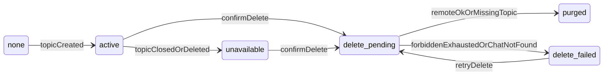

# M07.1 Conversation Topic Lifecycle and Repair

Canonical freeze draft: `/home/magpern/.claude/plans/m07-1-conversation-topic-lifecycle-and-repair-plan-v1.md` (correction pass applied; ready to freeze).

## 1. Baseline

Verified on `/opt/biopentra/dev/universal-telegram`:

- Branch: `feature/m11a-visitor-activity-digests` tracking `origin/feature/m11a-visitor-activity-digests`
- HEAD: `dee2135e1eeef4576d2d67da92a6d6e92ce49ad6` (clean worktree; porcelain empty)
- Expected `e69c5956e2d78d19630405540f37feb64bfb5f01` is the immediate parent (`Bump to 0.13.0…`); HEAD adds only `fix: escape literal */ in docblocks that broke PHP parsing`
- `origin/main`: `7011163fc645a0f8a9083f7eaa82530192215b16`
- Plugin `0.13.0`, migrator target **28** ([Migrator.php](dev/universal-telegram/src/Persistence/Migrator.php), [MigratorTest.php](dev/universal-telegram/tests/integration/Persistence/MigratorTest.php))

This slice lands on the same combined M11 branch. No merge to `main`, tag, release ZIP, or validation gate. Tests are written with work packages and join the deferred combined M11 gate.

Current failure mode (diagnosed, not re-tested here): plugin-created destination 14 (`supergroup` chat `-1003981752144`, `message_thread_id=57`) delivered on 2026-08-22 then dead-lettered `telegram_terminal_rejection` on 2026-08-23. Destination 1 (same chat, **NULL** thread = General) still sends. M07 [ConversationPurgeService](dev/universal-telegram/src/Conversations/ConversationPurgeService.php) and `delete_archived` never call Telegram. Retention 90-day purge is local-only. Classifier treats every HTTP 400/403 as generic terminal. No `forum_topic_closed`/`forum_topic_deleted` handling. Conversation-message `delivery_state` is set to `sent` at enqueue ([MessageRepository::mark_routed](dev/universal-telegram/src/Conversations/MessageRepository.php)). Detail page has no Archive/Delete UI even though `delete_archived` exists.

## 2. Lifecycle state machine

Two independent columns. Conversation `status` stays the M05/M07 operator workflow. New `topic_lifecycle_state` owns Telegram-topic health and deletion.

**Conversation status** ([ConversationStatus](dev/universal-telegram/src/Conversations/ConversationStatus.php)) additions only:

- `NEW|OPEN|WAITING_FOR_VISITOR|WAITING_FOR_OPERATOR|RESOLVED → ARCHIVED` (manual Archive, plus existing retention `RESOLVED → ARCHIVED`)
- `RESOLVED → OPEN` unchanged (reopen)
- `ARCHIVED` remains unreopenable (secret already revoked)

Manual Archive always: valid transition + `revoke_secret()` (frees `owner_active_slot`, visitor REST authenticates as expired). **No Telegram call.**

**`topic_lifecycle_state`** (new): `none | active | unavailable | delete_pending | delete_failed`

| Event | From | To | Remote | Local |
|---|---|---|---|---|
| Topic created (`mark_topic_created`) | `none` | `active` | — | existing dest+topic ids |
| Confident topic-closed/deleted (inbound or classified outbound; lookup is `(bot_id, chat_id, message_thread_id)` only) | `active` | `unavailable` | none | fixed code only |
| Confirm Delete permanently, eligible dest/topic | `active`/`unavailable`/`delete_failed` | `delete_pending` (CAS + lease) | enqueue only | stay `archived`; no purge |
| Confirm Delete, **ineligible** (no exclusive plugin topic) | any | (conversation gone) | **no API call** | local purge of this conversation only; destination row deleted only if exclusive |
| `deleteForumTopic` ok | `delete_pending` | (row gone) | success | purge including exclusive dest |
| API explicit missing-topic / missing-thread on **delete** | `delete_pending` | (row gone) | **already-absent success** | purge including exclusive dest |
| API `chat not found` on **delete** | `delete_pending` | `delete_failed` | none | **no purge**; code `telegram_topic_delete_chat_not_found` |
| Retryable delete failure, attempts remain | `delete_pending` | `delete_pending` | retry via `RetryPolicy` | retain |
| Retry exhausted / forbidden / token invalid | `delete_pending` | `delete_failed` | none further until operator retries | retain |
| Operator retries Delete permanently | `delete_failed` | `delete_pending` | enqueue | retain until success |

Permanent delete is **archive-first**: operator Archives (inspect, revoke visitor), then Delete permanently from `archived` only. Stale still-open conversations (dest 14) Archive then Delete; **explicit missing-topic/missing-thread** on delete is success then purge. `chat not found` is not. Retention 90-day step uses the same enqueue path, not a second clock.

`delete_pending` / `delete_failed` are topic states, not new `ConversationStatus` values. Conversation remains `archived`.

## 3. Telegram boundary

Official method: **`deleteForumTopic`** (`chat_id`, `message_thread_id`). Extend [TelegramApiClient](dev/universal-telegram/src/Telegram/Client/TelegramApiClient.php) with `delete_forum_topic(string $token, string $chat_id, int $message_thread_id): TelegramApiResult`. No `closeForumTopic` on Archive. No `sendMessage` for probing.

**Queue, never the confirming POST or GET.** Job type `conversation_delete_topic` (mirror [TopicCreationHandler](dev/universal-telegram/src/Conversations/TopicCreationHandler.php)). Admin/retention: CAS `topic_lifecycle_state=delete_pending` with `topic_delete_claim_expires_at`, then `Dispatcher::enqueue`. GET, Hub render, inbox, Bots tab: zero Telegram calls.

Idempotency: one logical delete per `conversation_id`. Handler no-ops if conversation already gone. Duplicate jobs: CAS/lease mismatch reschedules after observed lease (M06.2 pattern), never a second `deleteForumTopic` while a live claim exists.

Classification (match **lowercased `description`** against an allow-list, then discard the string; never persist it):

Delete path success: HTTP ok; or 400 whose description contains `message thread not found` / `topic not found` / `topic_id_invalid`. **Only those explicit missing-topic/missing-thread responses are already-absent success.**

Delete path terminal-without-purge: HTTP 401 → `telegram_token_invalid` (existing bot-invalid path, no local purge); HTTP 403 or “not enough rights” / `CHAT_ADMIN_REQUIRED` → `telegram_topic_delete_forbidden`; HTTP 400 `chat not found` → `telegram_topic_delete_chat_not_found` (the chat may still exist under another id or the bot may have lost the chat; **never treat as topic-already-absent**).

Delete path retryable: network, 429, 5xx, unrecognized 400 other than the missing-topic set and other than `chat not found`. After `RetryPolicy::max_attempts()` (5): `telegram_topic_delete_attempts_exhausted`, state `delete_failed`.

Outbound `sendMessage` 400/403 stays TERMINAL (ADR-0014, no retries). Reason code becomes specific **only** when the allow-list matches **and** the destination has `message_thread_id > 1`: `telegram_topic_not_found` or `telegram_topic_closed`. Otherwise keep `telegram_terminal_rejection`. **Do not** map `chat not found`, `bot was kicked`, parse errors, or “have no rights to send a message” to topic-unavailable.

Fixed codes (audit/context INTERNAL only): `telegram_topic_not_found`, `telegram_topic_closed`, `telegram_topic_unavailable` (inbound when closed vs deleted cannot be distinguished — prefer closed/deleted when the service-message key exists), `telegram_topic_delete_forbidden`, `telegram_topic_delete_chat_not_found`, `telegram_topic_delete_attempts_exhausted`, `telegram_token_invalid`.

Bot lacks `can_manage_topics` / `can_delete_messages`: `delete_failed` + `telegram_topic_delete_forbidden`. Operator grants rights, then retries Delete permanently. No local-only force-purge (would strand a live topic). Same for `telegram_topic_delete_chat_not_found`: operator repairs bot/chat membership, then retries.

## 4. Persistence and migration

`db_version` **28 → 29**. One additive step `step_29_add_conversation_topic_lifecycle_columns` on `wp_universal_telegram_conversations`:

- `topic_lifecycle_state VARCHAR(16) NOT NULL DEFAULT 'none'`
- `topic_lifecycle_code VARCHAR(64) NULL` (fixed codes only)
- `topic_delete_claim_expires_at DATETIME NULL`
- `KEY topic_lifecycle_state (topic_lifecycle_state)`
- **`UNIQUE KEY destination_id (destination_id)`** — exclusive destination ownership. MySQL/MariaDB unique indexes permit any number of NULLs, so conversations with no destination remain unconstrained.

Re-runnable: `table_has_columns` / `table_has_index` before ALTER (step 13/16 pattern).

Upgrade backfill (same step, after ADD columns, **before** UNIQUE): `UPDATE … SET topic_lifecycle_state='active' WHERE topic_creation_state='created'`. Do **not** probe Telegram. Existing stale topics stay `active` until inbound/outbound recognition or operator Delete (explicit missing-topic then purges). `pending`/`failed`/`none` stay `none`.

Duplicate `destination_id` repair (same step, before UNIQUE): for each non-null `destination_id` referenced by more than one conversation, keep exactly one owner — prefer `topic_creation_state='created'` whose `telegram_topic_id` equals that destination’s `message_thread_id`; otherwise lowest `id` — and `SET destination_id=NULL` on extras. Then add the unique index. Extras become remote-ineligible (local conversation purge must not delete the destination row). No administrator SQL.

Hydrate in [Conversation](dev/universal-telegram/src/Conversations/Conversation.php) / [ConversationRepository](dev/universal-telegram/src/Conversations/ConversationRepository.php). Replace inbound `find_by_topic(bot_id, telegram_topic_id)` with `find_by_bot_chat_thread(int $bot_id, string $chat_id, int $message_thread_id)` (JOIN destinations on `destination_id`, match `destinations.chat_id` and `destinations.message_thread_id = conversations.telegram_topic_id`). A thread id alone is never a lookup key. Add `find_by_destination_id()` (0 or 1 row under the unique index), CAS `try_begin_topic_deletion()`, `mark_topic_lifecycle()`, `count_by_destination_id()`.

Retention clocks **unchanged**: inactivity 30 → resolve; resolve → archive + revoke secret (same pass); 30-day body null from archive; 90-day **remote-delete-then-purge** instead of immediate `purge()`. Ineligible 90-day rows (no exclusive plugin topic) still local-purge this conversation only; destination row deleted only if exclusive. One handler, one clock.

[ConversationPurgeService](dev/universal-telegram/src/Conversations/ConversationPurgeService.php) stays the **only** local destructor and still never calls Telegram. Extend it to `ConversationNoteRepository::delete_for_conversation()` (notes are currently orphaned). Keep AI-draft raw delete. Destination delete remains DB-only, invoked **only after** remote success/explicit missing-topic, and **only** when this conversation is the exclusive owner. Shared-destination ineligible purge passes `$destination_id = null` so the dest row is retained.

Uninstall: no new table; existing `CONVERSATIONS_TABLE` drop removes the columns and unique index. Uninstaller list unchanged.

## 5. Administration UX

**Hub tab `operator-inbox`** ([ConversationInboxPage::TAB_ID](dev/universal-telegram/src/Administration/Conversations/ConversationInboxPage.php)). Detail: `admin.php?page={HubPage::SLUG}&tab=operator-inbox&conversation_id=N` ([ConversationDetailPage](dev/universal-telegram/src/Administration/Conversations/ConversationDetailPage.php)).

Inbox: add a “Telegram topic” column with operator labels `Healthy` / `Missing or closed` / `Deletion in progress` / `Could not delete topic` / `No topic` (from `topic_lifecycle_state`, never raw codes as primary copy). Filter includes existing statuses.

Detail actions via existing [ConversationActionHandler](dev/universal-telegram/src/Administration/Conversations/ConversationActionHandler.php) (`ADMIN_POST_ACTION` / `NONCE_ACTION`), `MANAGE_CONVERSATIONS` (or `MANAGE`), per-op capability re-check:

- **Archive** (`op=archive`): from `new|open|waiting_*|resolved`. Copy: “Archive this conversation. The Telegram topic is not deleted. The visitor can no longer send messages.” No confirm step.
- **Delete permanently**: only `status=archived` and not `delete_pending`. First POST `op=confirm_delete_permanently` **re-renders** the detail confirm form (POST-redirect-GET display). Second POST `op=delete_permanently` + `confirm=1` + nonce CAS-enqueues or local-purges if ineligible (shared dest: conversation only). Confirm copy: “This deletes the Telegram topic created for this conversation, then removes the conversation and its messages from WordPress. This cannot be undone.” Success notice: “Deletion started.” or “Conversation removed.” Failed: “The Telegram topic could not be deleted. The conversation was kept.” + mapped operator sentence for forbidden, exhausted, or chat-not-found.
- Reopen unchanged (`resolved` only).
- While `delete_pending`: no Archive/Delete/Reopen; banner “Deletion in progress. The Telegram topic is being removed.”
- `unavailable`: banner “This conversation’s Telegram topic is missing or closed. Archive it, then delete it permanently to clean up.”
- `delete_failed`: banner + Delete permanently retry. Operator sentences distinguish forbidden, exhausted, and chat-not-found (`telegram_topic_delete_chat_not_found`) without Telegram API text.

**Bots tab** ([BotManagementPage](dev/universal-telegram/src/Administration/Telegram/BotManagementPage.php)): Conversation topics list stays **read-only** (no delete/archive). Add “Open conversation” link via `find_by_destination_id()` → inbox detail URL. If no conversation row, omit the link.

M08 `/resolve` `/reopen` unchanged. No `/archive` or `/delete` command.

Capability/nonces: existing conversation nonce. Confirm delete uses the same nonce action (fresh token on the confirm form). Buttons are real `<button>`/`<input type="submit">` with visible labels. Notices use `wp_admin_notice` / Hub flash pattern already used by conversation actions.

## 6. Remote safety boundary

Class `ConversationTopicEligibility` (Conversations). Remote delete is allowed only when **all** hold:

1. Conversation `status === archived`
2. `topic_creation_state === created`
3. `telegram_topic_id` is int **> 1** (refuse NULL, 0, 1 = General)
4. `destination_id` non-null
5. Destination row exists, `bot_id` matches conversation, `kind === SUPERGROUP`
6. `destination.message_thread_id === conversation.telegram_topic_id` (int > 1)
7. Destination id **equals** this conversation’s `destination_id` (not merely “a dest in the same chat”)
8. **Exclusive ownership:** `COUNT(*)` of conversations with this `destination_id` is **exactly 1**, and that row is this conversation. If any other conversation references the same `destination_id`, the dest is ineligible: **no `deleteForumTopic`, no destination-row deletion**. Schema UNIQUE on `conversations.destination_id` is the durable enforcement; eligibility still checks COUNT so a failed/partial unique-index upgrade cannot delete a shared dest.

Negative cases (no `deleteForumTopic`, ever):

- Manual dest (Bots-tab created; no conversation owns it as `destination_id`)
- General: dest `message_thread_id` NULL (dest 1) or thread id `1`
- Unrelated admin-created forum topic (thread set but not this conversation’s recorded pair)
- Missing dest row, missing `telegram_topic_id`, `topic_creation_state !== created`
- Malformed ids (`<= 1`, type mismatch)
- Shared `destination_id` (second conversation references it)
- `delete_pending` claim held by another job

Ineligible confirmed delete → local purge of **this conversation** only (covers never-created / failed topics). Shared-dest case: purge conversation/messages/notes/drafts, pass `destination_id=null` into `ConversationPurgeService`. Eligibility is structural (ids + kind + equality + exclusive COUNT), never label/name.

## 7. Inbound / outbound / visitor

**Inbound** ([WebhookController](dev/universal-telegram/src/Telegram/Inbound/WebhookController.php) and [BotCommandDispatcher](dev/universal-telegram/src/Telegram/Commands/BotCommandDispatcher.php)): every topic lookup, including `maybe_route_to_conversation`, `forum_topic_closed` / `forum_topic_deleted` mark-unavailable, and command `resolve_context`, uses `find_by_bot_chat_thread($bot_id, $chat_id, $message_thread_id)`. Missing chat_id or thread id → no conversation match (same as today when thread is null). After dedup, if `message.forum_topic_deleted` or `message.forum_topic_closed` and the **tuple** hits, set `unavailable` + `telegram_topic_deleted` / `telegram_topic_closed`. Do **not** insert an operator message or run bot commands on those service messages. `my_chat_member` / bot kicked: unchanged, not topic-unavailable. Remove thread-only `find_by_topic(bot_id, telegram_topic_id)` from inbound paths.

**Outbound**: [SendMessageHandler](dev/universal-telegram/src/Telegram/Outbound/SendMessageHandler.php) after terminal dead-letter fires `do_action( 'universal_telegram_outbound_message_resolved', $uuid, $outcome, $failure_code )` with **fixed codes only**. Conversations subscriber: map uuid → conversation message; `sent` → `delivery_state=sent`; dead-letter → `failed`; topic codes → mark conversation `unavailable` only if the outbound destination’s `(bot_id, chat_id, message_thread_id)` equals that conversation’s recorded exclusive dest/topic tuple. Telegram does not import Conversations.

**Visitor REST** ([ConversationsController](dev/universal-telegram/src/Conversations/Rest/ConversationsController.php)):

- Archived / deleting / purged / secret revoked: existing `controlled_not_found` + `conversation_expired` (no new enumeration)
- `topic_lifecycle_state=unavailable` and secret still present: **POST** refuses **before** `messages->create`, HTTP 409, `ok:false`, `reason: conversation_unavailable` (new [ResponseReason](dev/universal-telegram/src/Conversations/ResponseReason.php) case). Poll still returns history; add additive `topic_state: unavailable` on poll. Widget copy uses that reason only — never Telegram text
- `delivery_state`: `stored | routed | sent | failed`. `mark_routed` writes **`routed`**. `sent` only after outbound `mark_sent`. Widget already surfaces `delivery_state`

## 8. Work packages

1. **WP1 Persistence** — Migrator step 29 (lifecycle columns **and** unique `destination_id`, duplicate-dest NULL repair before UNIQUE), Conversation/Repository hydrate+CAS, `find_by_bot_chat_thread`, `count_by_destination_id`, ConversationStatus archive edges, ConversationNoteRepository::delete_for_conversation, PurgeService notes + dest-delete only when caller passes dest id. DB: 28→29. Tests: MigratorTest step 29 + backfill + unique dest + duplicate repair; ConversationStatusTest; ConversationPurgeServiceTest notes and shared-dest retains dest row; ConversationRepository CAS and tuple lookup (thread-only query must not exist on inbound helpers). Commit: `feat(conversations): add topic lifecycle columns and archive transitions`

2. **WP2 Telegram client + classifier** — `delete_forum_topic`; `TelegramTopicError` allow-list helper; SendMessageHandler specific dead-letter codes; classifier unit tests (positive missing-topic/closed; **negative** `chat not found` on both send and delete — delete maps to `telegram_topic_delete_chat_not_found`, not already-absent; generic 400s stay generic). DB: none. Commit: `feat(telegram): add deleteForumTopic and topic-specific terminal codes`

3. **WP3 Queued deletion** — Eligibility (including exclusive COUNT), TopicDeletionDispatcher/Handler, Plugin HandlerRegistry, lease crash semantics, explicit missing-topic → purge; `chat not found` → `delete_failed` no purge. Tests: eligibility negatives including shared `destination_id`; handler success/absent/forbidden/chat-not-found/retry; duplicate-job lease. DB: none beyond WP1 columns. Commit: `feat(conversations): queue confirmation-gated Telegram topic deletion`

4. **WP4 Retention** — RetentionCleanupHandler 90-day calls dispatcher; ineligible local purge (shared dest does not drop dest); inactivity/30-day unchanged. Tests: RetentionCleanupHandlerTest remote vs ineligible vs shared dest; no duplicate clock. Commit: `feat(conversations): retention purge waits for remote topic deletion`

5. **WP5 Admin UX** — Detail Archive/confirm-delete/banners; inbox column; Bots-tab conversation link; ActionHandler ops; no GET side effects. Tests: ConversationActionHandlerTest, ConversationDetailPageTest, BotManagementPage conversation link. Commit: `feat(conversations): add archive and permanent-delete operator UI`

6. **WP6 Inbound/outbound/visitor** — webhook + bot-command tuple lookup; service messages mark-unavailable only on tuple hit; outbound action + delivery_state; REST 409 + poll `topic_state`. Tests: WebhookControllerConversationRoutingTest (same thread id, wrong chat_id must not match); BotCommandDispatcherFamily* context uses tuple; SendMessageHandlerTest codes; ConversationsControllerTest unavailable POST and no false `sent`. Commit: `feat(conversations): mark missing topics unavailable without leaking Telegram errors`

7. **WP7 Cross-slice tests** — Woo-absent instantiation of new classes; UninstallTest still drops conversations; package/acceptance db_version 29 assertion in existing package tests. Commit: `test(conversations): cover topic lifecycle upgrade and uninstall`

8. **WP8 Version/docs on the M11 branch** — `0.13.0`→`0.14.0`, readme stable tag, ARCHITECTURE versioning+db 29, ADR-0031 freeze, plan committed under `docs/plans/`. **No tag, no main merge, no CI gate run as a release.** Commit: `docs(conversations): freeze M07.1 topic lifecycle (ADR-0031)`

## 9. Testing (written now, run in combined M11 gate)

- Manual archive: secret revoked, topic dest row remains, no API client call
- Confirmed permanent delete: eligible → `delete_pending` + job + purge after ok
- Missing-topic idempotent cleanup: deleteForumTopic 400 thread-not-found / topic-not-found / topic_id_invalid → purge
- `chat not found` on deleteForumTopic → `delete_failed` + `telegram_topic_delete_chat_not_found`; conversation and dest retained; no purge
- Transient remote failure: 500 then success retains until success; exhausted → `delete_failed`, row remains
- Recognized topic-unavailable: inbound closed/deleted **only** when `(bot_id, chat_id, message_thread_id)` matches; same thread id in a different chat does not match; outbound allow-list; generic 400 and `chat not found` on send do not flip topic state
- Negatives: manual dest, General NULL/1, unrelated thread, missing relationship, malformed id, **shared destination_id** — zero `deleteForumTopic` and no dest-row delete on the shared case
- Retention 90-day uses dispatcher; 30-day null still local
- Upgrade: created topics backfill `active`; duplicate dest ids nulled to one owner then UNIQUE; stale dest 14 deletable without SQL
- WooCommerce-absent: new classes construct
- Package/uninstall: db 29; tables dropped including new columns
- Manual checklist (deferred gate): Archive; confirm Delete permanently; reopen a closed topic then retry send; delete already-removed topic; observe chat-not-found repair banner; confirm Bots-tab list has no delete control and links to inbox

## 10. ADR / version / database

**ADR-0031 is required** (ADR-0005/0001): persistence change; destructive remote security boundary; public REST additive reason; supersedes ADR-0026 “manual delete never calls Telegram” and ADR-0021 “90-day purge is local-only”. No new top-level boundary (Conversations + Telegram Client + Administration\Conversations).

Version on combined M11 branch: **`0.13.0` → `0.14.0`** (new capability class). **`db_version` 28 → 29**. Implementation, validation, PR, merge, and closure remain deferred on `feature/m11a-visitor-activity-digests`.

### ADR-0031 full text (excluded from the 3,000-word cap)

# ADR-0031 — Conversation Topic Lifecycle: Archive, Remote Forum-Topic Deletion, and Topic-Unavailable Repair

## Status

Proposed

## Context

M05/ADR-0021 creates one Telegram forum topic per visitor conversation and one generated destination row (`supergroup` + `message_thread_id`). M07/ADR-0026 archives locally and purges locally; `ConversationPurgeService` and retention must not call the Bot API. Operators can delete those topics in Telegram. The plugin then keeps a healthy-looking conversation whose outbound sends dead-letter as generic `telegram_terminal_rejection` (HTTP 400/403), with no stored API text (ADR-0009/0014) and no safe cleanup except database edits. ADR-0014 classifies every 400/403 as terminal without distinguishing a missing topic from parse errors or a missing chat. Conversation messages are marked `sent` when handed to the outbound table, before Telegram accepts them.

## Decision

1. **Split state.** Operator workflow remains `ConversationStatus`. Telegram-topic health lives in `topic_lifecycle_state` (`none|active|unavailable|delete_pending|delete_failed`) plus `topic_lifecycle_code` (fixed codes only).
2. **Manual Archive** is a local transition to `archived` plus `revoke_secret()`, from `new|open|waiting_*|resolved`. It does not call Telegram and does not delete the generated destination.
3. **Manual Delete permanently** exists only on the operator-inbox conversation detail (not the Bots destination list). It requires `archived`, `MANAGE_CONVERSATIONS`, nonce, and a second confirming POST. GET/render never deletes. If `ConversationTopicEligibility` passes, the request CAS-enqueues `conversation_delete_topic` and returns; `TelegramApiClient::delete_forum_topic` runs only in that job. Success or **explicit missing-topic/missing-thread** then calls `ConversationPurgeService`. `chat not found` is **not** already-absent: it marks `delete_failed` with `telegram_topic_delete_chat_not_found` and retains local rows. Ineligible rows (no exclusive plugin-created topic) purge this conversation locally with no API call; a shared `destination_id` is ineligible and the destination row is not deleted.
4. **Eligibility is structural:** conversation-owned `destination_id`, `topic_creation_state=created`, `telegram_topic_id === destination.message_thread_id`, both `> 1`, same `bot_id`, kind `supergroup`, and **exclusive ownership** (exactly one conversation references that `destination_id` — this one). Schema UNIQUE on `conversations.destination_id` enforces exclusivity after a duplicate-nulling upgrade repair. Manual destinations, General (`NULL` or thread `1`), unrelated topics, missing rows, malformed ids, and shared destinations are ineligible.
5. **Retention** keeps the 30/90-day clocks. The 90-day step uses the same remote-delete-then-purge path. No second retention mechanism.
6. **Topic-unavailable:** inbound `forum_topic_closed`/`forum_topic_deleted`, or outbound terminal errors whose description allow-list matches thread-not-found / TOPIC_CLOSED **and** whose destination thread id is `> 1`, set `unavailable` with a fixed code. **Every inbound topic lookup and mark-unavailable path requires the exact `(bot_id, chat_id, message_thread_id)` tuple**; a thread id alone is never identity. Generic 400/403 and `chat not found` stay `telegram_terminal_rejection` (send) or `telegram_topic_delete_chat_not_found` (delete) and do not change topic state to unavailable / already-absent. Raw descriptions are never stored, audited, or returned to visitors.
7. **Visitor contract:** archived/purged remain non-enumerating 404 `conversation_expired`. Open-but-unavailable POST returns 409 `conversation_unavailable` without inserting a message. `delivery_state` `sent` means Telegram accepted the send.
8. **Crash safety:** delete uses compare-and-set plus `topic_delete_claim_expires_at`. Duplicate jobs do not double-delete. Transient failures leave local rows in `delete_failed` or still-pending retry. Forbidden deletion and `chat not found` never purge locally.

## Alternatives

- Synchronous `deleteForumTopic` inside the admin POST — rejected: request timeout and crash would desynchronize Telegram and WordPress; M06.2 already forbids visitor-path sync except the bounded Test Message.
- Reusing `ConversationStatus` for `deleting`/`unavailable` — rejected: would collide with reopen/retention and `owner_active_slot`.
- Force local purge when the bot cannot delete — rejected: would strand a live Telegram topic.
- Scanning Telegram during migration — rejected: migrations must not call providers.

## Consequences

ADR-0026’s “manual delete never contacts Telegram” is superseded for **eligible plugin-created topics only**. ADR-0021’s 90-day local-only purge is superseded by remote-then-local for those topics. ADR-0014’s TERMINAL class remains; send-path reason codes gain `telegram_topic_not_found` / `telegram_topic_closed`; delete-path adds `telegram_topic_delete_forbidden`, `telegram_topic_delete_chat_not_found`, and `telegram_topic_delete_attempts_exhausted`. Bots-tab conversation topics stay read-only and may link to the inbox.

## Security and privacy impact

Destructive Bot API use is confirmation-gated, capability-gated, queued, and eligibility-checked, including exclusive destination ownership. Audit context carries conversation id and fixed codes only (INTERNAL). Visitor REST never receives Telegram descriptions. Secrets remain revoked at archive before purge. Inbound conversation identity is `(bot_id, chat_id, message_thread_id)`, never a thread id alone.

## Affected Documents/Milestones

M07.1 on the combined M11 branch; `docs/ARCHITECTURE.md` versioning; operator inbox/detail; Telegram client; webhook inbound; conversation REST; retention handler. M08 command surface unchanged.

## Compatibility/Migration Impact

`db_version` 28→29, additive columns plus UNIQUE `conversations.destination_id` after duplicate-nulling repair, backfill `active` where `topic_creation_state=created`. Existing stale conversations become cleanable via Archive then Delete permanently without SQL. Plugin version 0.13.0→0.14.0 on the combined M11 branch only; no production release in this slice.

## 11. Self-review (correction pass)

- **Remote destructive safety:** `deleteForumTopic` only from the queued handler after eligibility, including exclusive COUNT/UNIQUE. Shared dest: no API call, no dest delete. GET/render/unconfirmed POST: no API call. General and manual dests ineligible.
- **State transitions:** Archive local-only. Missing-topic on delete purges. `chat not found` on delete → `delete_failed` + `telegram_topic_delete_chat_not_found`, retain. Forbidden/exhausted retain. Inbound unavailable requires the full tuple.
- **Raw-error exclusion:** allow-list match then discard; only fixed codes in DB, audit, REST, and notices.
- **Existing-stale-topic recovery:** dest 14 Archive then Delete; explicit missing-thread is success; no admin SQL. Duplicate dest ids repaired in step 29.
- **Migration:** 28→29 additive; UNIQUE after repair; backfill `active`; no provider calls.
- **Retention:** same 30/90 clocks; 90-day uses dispatcher; shared-dest ineligible path does not drop the dest.
- **Test traceability:** tuple mismatch, shared dest, chat-not-found-on-delete, missing-topic-on-delete, generic 400, Archive, confirm delete, retention, upgrade, Woo-absent, uninstall — each named in §8–§9.
